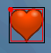
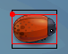
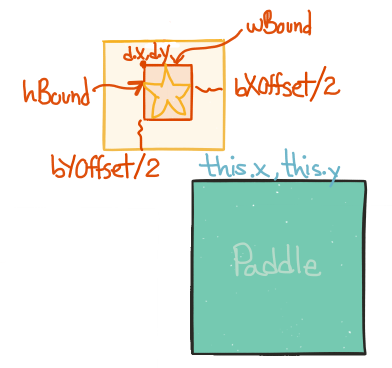

# Collision Detection

In order to determine whether a collision has happened, each iteration of the draw loop requires that all active drops are tested to see if their geometry intersects with the geometry of the catcher or paddle object.  Shiffman's game used ellipse objects, so collision checking was a simple comparison between the distance between ellipse centers as compared to the radius of the 2 objects.  Since we're going to use PImage and PShape objects, which have rectangular geometry, then we need to redesign the collision tests for our objects.  

###Bounding Boxes
Since we're using .png images and svg graphics, these image formats allow for transparency, so our objects can visually appear smaller than the actual image dimensions.  For that reason, we want to add additional geometry variables that can be used to define a bounding box around our images, and it will be the bounding box dimensions that are used to determine if objects have overlapping geometry.

###Bounding Box Variables in Drop Base Class

Since we want to be able to test for intersection for any type of drop object, or for a child class of a drop object, then we need to create instance variables within the base class that can be inherited by any child classes.  

The following Drop Class instance variables will allow us to set bounding box dimensions as separate elements from the actual graphic element which might be a PImage or a PShape.  Then, in the child drop class, we can define bounding box dimensions which might be different than the actual png or svg graphic image.  Ideally, we would want to provide a constructor or method to set these values for child drops.  We can define a bounding box offset for X and Y dimensions that specifies the size difference between the graphic and the bounding box.

```java
bXOffset //bounding box Xoffset
bYOffset //bounding box YOffset
wBound=w-bXOffset; // bounding box width
hBound=h-bYOffset; //bounding box height
````

For the Drop classes, if we define the bounding box dimensions as above, then in the display() method for child drop classes: PImageDrop and PShapeDrop, which override the parent Drop method, if we create a rectangle with noFill() using the bounding box dimensions to help

The images below show the red bounding box compared to the actual image dimensions.  The star image needs a smaller bounding box, while the heart image size and bounding box are essentially the same size.

    

Below is the constructor for the PImageDrop, x and speed aren't defined since the values set in the parent Drop class work fine to initialize the PImageDrop class.  

 ```
  ImageDrop(PImage _img,  float _w, float _h, float _bXOffset, float _bYOffset){
    y = random(-40,-80);   // Start a little above the window
    img=_img;
    w = _w;   //display width size
    h = _h;  //display height
    bXOffset=_bXOffset;  //Xsize difference for bounding box
    bYOffset = _bYOffset;  //YSize difference for bounding box
    wBound=w-bXOffset;  //bounding box width
    hBound=h-bYOffset;  //bounding box height
    value=5;  //point value
  }
```
Below is the display method for PImage drop, with code to draw the bounding box and an ellipse at the origin.

```
void display(){
        translate(x,y);  //move the  origin to x,y
        image(img, -bXOffset/2,-bYOffset/2,w,h);  //display the image, offset 
        noFill();
        stroke(255,0,0);
        rect(0,0,wBound,hBound); //bounding box, 
        fill(255,0,0);
        ellipse(0,0,5,5);  //origin
        resetMatrix();
      }  //end display 
```
###Paddle Class
Finally, we can see how wBound and hBound are used in the Paddle Intersection Method

```
boolean intersect(Drop d){  //fix  //use drop wBound, hBound for intersection
        boolean isIntersecting = false;
         if(((d.y + d.hBound) > this.y) && (( d.x + d.wBound ) > this.x) && (d.x <(this.x + this.xSize))){
             isIntersecting=true;
         }
        return isIntersecting;
      }

```
If we define bXOffset, bYOffset as the size difference between the image and the bounding box, then we can have the image offset by half of that size in the negative x and y locations so we can still use d.x and d.y as the origin for determining bounding box for collisions, this makes our intersect code easier to read..


