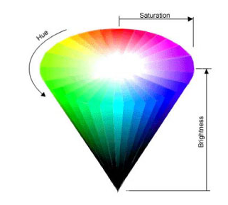

#HSB Color Mode

Image from: [TomJewett.com](http://www.tomjewett.com/colors/hsb.html)

###HSB Colors
The image above shows the HSB color-space.  From this diagram, we can see that if we want to understand a specific HSB color, in terms of Hue, Saturation, and Brightness parameter values, it is easiest to read a HSB color starting with the brightness parameter which corresponds to the verticle axis of the color-cone.  The brightness scale defines grayscale colors, where a brightness value of 0 corresponds to black, and the max-brightness corresponds to white.  So, if we see an HSB value with O for brightness, the other values don't impact the color because the colorspace is at the lowest tip of the cone, black is the only color in this region.  So for a fill() function with 3 values fill(H, S, B), we should start reading the color from the right-most parameter, the B value.  If the B value is 255 (the max value), then we can see that these colors correspond to the top surface-edge of the cone.  Within this circular slice, we can see that the center of the circle is white, and as the radius increases, the saturation increases so the outer rim of the circle has full saturation values.  So, when analyzing an HSB value, once we've determined that B is greater than 0, we next need to look at the S value to determine the saturation level.  This corresponds to moving outwards from the centerpoint of the circle, to colors with higher saturation intensity.  The hue value corresponds to the angle of rotation around the circle.  This image shows the hue angle incorrectly, for processing the hue values increase in the clockwise direction, with the 0 value at the 3 o'clock position. 

