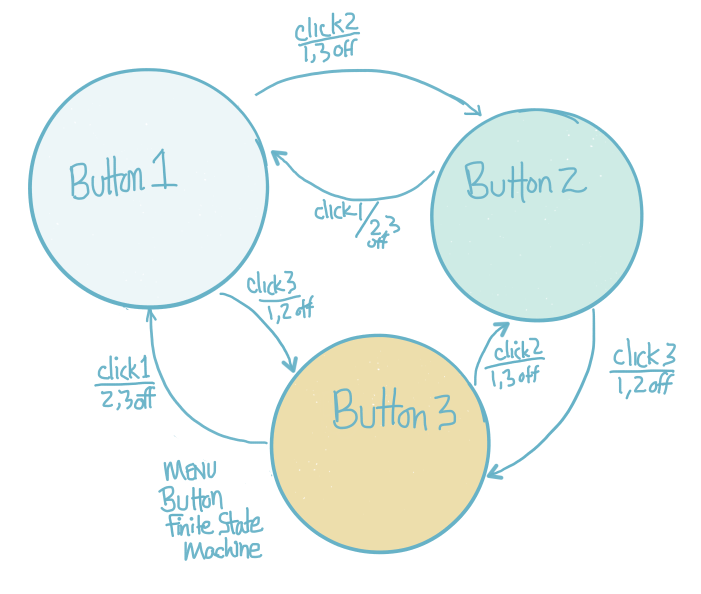

#Menu Object with Buttons

Now that we've created our button class, which is our template to create button objects, it's time to leverage our hard work to simplify the drawing application

###Composition:  A Menu *Has* Button Objects
We will create the Menu class, and it will be composed of a set of button objects.  The button objects are responsible for most of their own behavior, however, since we want these buttons to work together as a radio-button type menu, we're going to have to add some additional logic to the Menu class to insure that only 1 button is active at a time.  


### Menu Code: 
In the code below, we have created the Menu Class, we've added 3 button objects, they are initialized in the constructor and we've created a ``display()`` and ``click()`` method. Within the Menu ``display()`` method, we simply call the ``display()`` method for each button. However, right now these buttons don't have the required logic needed for them to function as a menu, we still need to add additional control logic to the ``click()`` method. Currently, each of these buttons each works independently.  

```java
class Menu{
  
  Button btn1, btn2, btn3;
  float xPos, yPos, btnSize;
  
  Menu( float _xPos, float _yPos, float _btnSize){
          btn1= new Button(_xPos, _yPos, _btnSize, _btnSize);
          btn2= new Button(_xPos, _yPos+_btnSize, _btnSize, _btnSize);
          btn3= new Button(_xPos, _yPos + (2*_btnSize), _btnSize, _btnSize);
  }
  
  void display(){
    btn1.display();
    btn2.display();
    btn3.display();
  }
 
 //this isn't working correctly, each button functions independently
  void click(int mx, int my){
       btn1.click(mx, my);
       btn2.click(mx, my);
       btn3.click(mx, my);
  }
  
}  //end class

```
What code do we need to add to create the radio button behavior?

###Menu Buttons Finite State Machine


In the image above, each circle represents the state of the system when that button is the active button.  The arrows or arcs show the events that cause the system to change state.  The arc from Button1 to Button2 shows that if Button1 is the current ``activeButton``, then if the user clicks on button 2, the system will change state so that Button2 will be the ``activeButton``.  The arcs also show the other actions that we must implement when the click2 event happens:  we must set all other buttons to the off-state.  In our code, we'd set ``btn1.on=false`` and ``btn3.on=false``.  This means we assign the value of false to the ``on`` instance variable for the ``btn1`` and ``btn3`` objects.  Therefore, In the Menu class, we need to implement a state variable:  ``activeButton`` which will store the current-state.  In addition, we must supply logic so that when these events happen, the other buttons are de-activated.  

###ActiveButton variable
We need a variable to store the current activeButton, we can use an int variable and constant values for our allowed states for buttons: 1, 2, 3:

```java
int activeButton=0;  //no buttons are active 
final button1 = 1;   //constant value can't be modified
final button2 = 2;   // we use these as state indicator variables
final button3 = 3;   // this makes our code easier to understand
```
 
###Menu Click Method()
In the code above, when a click event happens we simply call all menu-button click events, and after those events, we may have several buttons in the on-state.  It's impossible for us to know which button was most recently clicked, or which button had already been in the on state.  So, we need to add some logical structure to our code so we can determine which button should be identified as the activeButton.   

###Button1 Click()
Based on the image above, we can start to think about this logic by focusing on just Button1.  We can see from the image that the only time we need to worry about button1 being clicked is when it isn't currently the ``activeButton``.  If we verify that activeButton != button1, then we can check the state of btn1 after the button1.click() method is executed, if it is now in the on state:  ``btn1.on==true``, then we know to change set activeButton=button1.  In addition, as shown in the FSM image above, we also know that we need to manually set both btn2 and btn3 off, we do this by setting btn2.on=false.  We don't need to know which state was the previous active state...it could have been either button2 or button3, but we set both of their internal states to off and we're on our way to having working radio buttons.  We simply need to write similar tests for the cases when we know that button2 is not the activeButton, and similarly with button3.  The code below shows the logic for button1.
```java
void click(int mX, int mY){
        // check to make sure btn1 is not the current activeButton
      if(activeButton != button1){
        btn1.click(mX, mY);   //call the click method for btn1
        if(btn1.on==true){  //the button has just been activated by the click event
            btn2.on=false;  //set btn2 off
            btn3.on=false;  //set btn3 off
            activeButton=button1;
         }// end if btn.on
        } // end if activeButton
       //this code must be completed for each of the buttons
      } // end click
      ```


