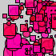

# MenuArray-Code

MenuArray Class
```
class MenuArray{
    //instance variables
    Button[] btnArray;  //declare an array of Buttons
    int numButtons;     //how many Buttons are there?
    int activeButton=-1;
    
    MenuArray( Button[] _btnArray, int _numButtons){
      this.btnArray=_btnArray;  //initialize instance variables with 
      this.numButtons=_numButtons;
    }
  //methods 
  void display(){
    for(int i=0;i<numButtons;i++){
      btnArray[i].display();
    } //end for
  }// end display
    
   void click(int mx, int my){
     for(int i=0;i<numButtons;i++){
       if(activeButton != i){
        btnArray[i].click(mx, my); //call the click method
        if(btnArray[i].on==true){
          activeButton=i;
          for(int j=0;j<numButtons;j++){
            if(j !=i){
               btnArray[j].on=false;
            } //end if j!=i
          } //end for j
        }//end if on
       }// end if active
    } //end for i
  } // end click
  
}// end class
```
Button Class

```
///this is our Button base-class
class Button{
  //instance variables
  float x, y, w, h;
  boolean on;
  color buttonColorOn, buttonColorOff;

  //default constructor
  Button(){
    this(0,0,50,50); 
  }

  Button( float _x, float _y, float _w, float _h){
      this.x = _x;
      this.y=_y;
      w = _w;
      h = _h;
      on =false;
      buttonColorOn= color(255,0,0);
      buttonColorOff=color(0,255,0);
  }

  //methods
  void display(){
    if(on){
      fill(buttonColorOn);
    }
    else{
      fill(buttonColorOff);
    }
      rect(x,y,w,h);
  }

  void click(int mx, int my){ //check to see if mouse is over button when clicked is called
      if(( (mx > x) && (mx <(x+w)))  && (( my> y  ) && (my < (y+h)))){
          on=!on; 
         // println("buttonState: " + on);
      }//end if
  } // end click

}  //end of Button class
```


Main Tab

```
//Global Variable Declaration

Button[] btnArray;
MenuArray myMenuArray;

//initialization
void setup(){
  size(400,400);
  int numButtons=3;
  btnArray=new Button[numButtons];
   //   initialize each element
  int size=50;
  for( int i=0;i<numButtons;i++){
    btnArray[i]= new Button(50,i *size, size,size);
  }
  myMenuArray = new MenuArray(btnArray, numButtons);
   //call menu constructor using an array input parameter
}                            

void draw(){
  myMenuArray.display();

}

void mouseClicked(){
 
   myMenuArray.click(mouseX, mouseY);

}
```

