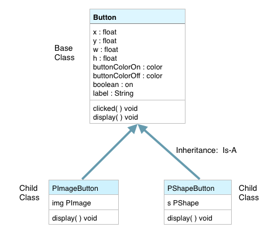

# Object Inheritance

One of the most powerful aspects of Object-Oriented programming is that we can utilize inheritance relationships as we create objects.  Inheritance relationships in real-world contexts help us to understand shared features that are the result of natural processes like evolution. OOP allows us to design our classes to take advantage of these natural relationships between classes.  If we look at relationships in evolutionary species, such as Darwin's finches, each successive generation becomes more specialized, yet each of the species still shares a group of common features with their common ancestor.  

As we design classes, we want to think about designing a base-class that can function as the parent class for one or more specialized child classes.  We see these relationships as the basis for how we classify and categorize objects in the world.  We might have a parent class called `Car`, this *base-class* would have properties and behaviors that are shared by all Car objects with properties like:  wheels, engine, seats, and behaviors like: drive, stop, refuel.  Then we could have child classes that were specialized types of cars: mini-van, sports-car, station-wagon, convertible-coupe...etc.

For our project, we'll look at inheritance in 2 cases.  We'll first create a generic Button class.  Then we'll create more specific types of Buttons:  PImageButton and PShapeButton.  These special Button child classes will allow us to add additional features compared to the generalized Button class. 

###Button Base Class


As seen in the UML class diagram below,  the PImageButton and PShapeButton classes are child classes of the base class:  Button.  They have an inheritance relationship, this is refered to as an 'Is-A' relationship.  When we define these classes, we only define new instance variables that are not inherited from the base class.  We can also indicate which methods are going to be over-ridden in the child class by listing them in the child class.  So, from the diagram below, we see that thePImageButton has a PImage img instance variable and it provides implementation for display().   



###PImageButton Class

If we look at the code for the PImage Button below,in the first line, we see that we use the keyword *extends* which is how we indicate that this class inherits from the Button base class. Then  we see that we are able to call the Button base class constructor uses the *super* keyword to call the Button base class constructor ``super()``.  In addition, we can also use  *super* as a way to call the Button base class methods: ``super.display()``.  This allows us to first call the Button display method, which gives use the background display of the default Buttons, then we can display the image() to customize the appearance of the PImageButton.  

```
class PImageButton extends Button{
  PImage img;
  
  PImageButton(String _imgFile){
       super();
       this.img= loadImage(_imgFile); 
  }
  PImageButton(float _x, float _y, float _w, float _h, String _imgFile){
       super(_x, _y, _w, _h);
       this.img= loadImage(_imgFile); 
  }
  
  void display(){
        super.display();
        image(img, x+5,y+5,w-10,h-10);
  }  
}
```

To create a PImage object in the main tab, we must first make sure we have an image that we can use in our project.  In order to use any files as data files for our project, we must create a `data` folder inside our project folder.  To learn more about how to use PImage objects, refer to the Processing.org website Reference. To create a PImage button, we can create a reference-type variable of type PImageButton and then we pass the filename to the PImageButton constructor.
```
String imgfile = "pattern1Btn.png";
PImageButton pimageBtn=new PImageButton(50,150,50,50,imgfile); 
```
In the draw loop we need to call the display method of our pimageBtn:
``pimageBtn.display()``.  In the mouseClicked funtion we need to call the click() method.
``pimageBtn.click()``.  We haven't defined the click( ) method in the code above because we want to use the Button base class click( ) method.  By not redefining click( ) in the child class, 
